<!-- ========================================================= -->
<!--                    SUMIT YADAV                            -->
<!--              GitHub Profile README                        -->
<!-- ========================================================= -->

<!-- ===================== FUTURISTIC HERO ===================== -->

<p align="center">
  
</p>

<br>
<!-- ======================== SOCIALS ======================== -->

<p align="center">

<a href="https://github.com/Sumit-Yadav2611">
  
</a>

<a href="https://www.linkedin.com/in/sumit-yadav-8a8929357/">
  
</a>

<a href="https://my-portfolio-49e7.vercel.app/">
  
</a>

<a href="https://leetcode.com/u/Sumit_Krishna/">
  
</a>

<a href="https://youtube.com/@sumitkrishnanitp">
  
</a>

</p>

---

<!-- ======================== ABOUT ========================== -->

# 👨‍💻 About Me

<p align="center">

I'm a <b>Computer Science & Engineering student at NIT Patna</b>
passionate about building practical software and solving real-world problems.

I enjoy turning ideas into working applications while continuously improving
my problem-solving and software engineering skills.

</p>

<br>

<table>
<tr>

<td width="50%" valign="top">

### 🎓 Education

- 🏫 **NIT Patna**
- 💻 **B.Tech — Computer Science & Engineering**
- 🇮🇳 India

</td>

<td width="50%" valign="top">

### 💡 Interests

- 🌐 Full-Stack Development
- 🧠 Data Structures & Algorithms
- 🤖 Artificial Intelligence
- 📊 Machine Learning
- 🏗️ Software Engineering

</td>

</tr>
</table>

---

<!-- ===================== TECH STACK ======================== -->

# 🛠️ Tech Stack

### 💻 Programming Languages

<p>
  
</p>

### 🌐 Web Development

<p>
  
</p>

### 🗄️ Databases

<p>
  
</p>

### ⚙️ Tools & Platforms

<p>
  
</p>

---

<!-- ===================== PROJECTS ========================= -->

# 🚀 Featured Projects

<table>

<tr>

<td width="33%" valign="top">

## 🤖 JobBuddy AI

AI-powered resume builder designed to help users create professional and ATS-friendly resumes.

### Tech

`React` `Tailwind CSS`  
`PostgreSQL` `Drizzle` `Clerk`

<br>

<a href="https://github.com/Sumit-Yadav2611/JobBuddy-AI">
  
</a>

</td>

<td width="33%" valign="top">

## 🌦️ Weather Hub

Responsive weather application providing real-time weather information, forecasts, AQI, location search and weather maps.

### Tech

`React` `Tailwind CSS`  
`OpenWeatherMap API`

<br>

<a href="https://github.com/Sumit-Yadav2611/Weather-Hub">
  
</a>

</td>

<td width="33%" valign="top">

## 🤖 SumoChat AI

AI-powered assistant exploring conversational AI, document understanding, vision and generative AI.

### Tech

`React` `JavaScript`  
`AI APIs`

<br>

<a href="https://github.com/Sumit-Yadav2611/SumoChat-AI">
  
</a>

</td>

</tr>

<tr>

<td width="33%" valign="top">

## 🛒 ShopHub E-Commerce

Full-stack e-commerce application with authentication, product management and backend APIs.

### Tech

`Node.js` `Express`  
`MongoDB` `Mongoose`

<br>

<a href="https://github.com/Sumit-Yadav2611/ShopHub-Ecommerce">
  
</a>

</td>

<td width="33%" valign="top">

## 💼 Developer Portfolio

Personal portfolio showcasing my projects, skills and journey as a software developer.

### Built With

`React` `Tailwind CSS`  
`Vercel`

<br>

<a href="https://my-portfolio-49e7.vercel.app/">
  
</a>

</td>

<td width="33%" valign="top">

## 🧩 More Projects

Explore my repositories to see additional projects, experiments and development work.

<br><br>

<a href="https://github.com/Sumit-Yadav2611?tab=repositories">
  
</a>

</td>

</tr>

</table>

---

<!-- ===================== PROBLEM SOLVING ================== -->

# 🧠 Problem Solving

<p align="center">

<a href="https://leetcode.com/u/Sumit_Krishna/">
  
</a>

</p>

<p align="center">
  <i>
    Solving problems, learning algorithms and improving one step at a time.
  </i>
</p>

---

<!-- ===================== GITHUB STATS ===================== -->

# 📊 GitHub Statistics

<p align="center">


</p>

<p align="center">


</p>

---

<!-- ===================== ACHIEVEMENTS ===================== -->

# 🏆 Achievements

<table>

<tr>

<td width="50%" valign="top">

### 🎓 Academic

- 🎯 **98.76 percentile** — JEE Main
- 📚 **95%** — Class 12
- 💻 **B.Tech CSE** — NIT Patna

</td>

<td width="50%" valign="top">

### 🏑 Sports

- 🏆 School Hockey Team Champion
- 🥇 Multiple district-level medals
- ⚽ Passionate about sports & fitness

</td>

</tr>

</table>

---

<!-- ===================== CURRENTLY LEARNING ============== -->

# 📚 Currently Learning

<p align="center">


</p>

```text
🧠 Data Structures & Algorithms
🌐 Full-Stack Development
🤖 Artificial Intelligence & Machine Learning
🏗️ System Design
💡 Problem Solving
```

---

<!-- ===================== CONTRIBUTION JOURNEY ============= -->

# 🐍 Contribution Journey

<p align="center">

  

</p>

---

<!-- ===================== GOALS ============================= -->

# 🎯 What I'm Working Toward

<table>

<tr>

<td width="50%" valign="top">

### 🚀 Engineering Goals

- 🧠 Master Data Structures & Algorithms
- 🌐 Build production-ready applications
- 🤖 Develop practical AI-powered systems
- 🏗️ Learn scalable software architecture
- 🌍 Contribute to Open Source
- 📈 Become a stronger software engineer

</td>

<td width="50%" valign="top">

### 🧩 My Development Loop

```text
        ┌─────────┐
        │  Learn  │
        └────┬────┘
             ↓
        ┌─────────┐
        │  Build  │
        └────┬────┘
             ↓
        ┌─────────┐
        │  Break  │
        └────┬────┘
             ↓
        ┌─────────┐
        │  Debug  │
        └────┬────┘
             ↓
        ┌─────────┐
        │ Improve │
        └────┬────┘
             ↓
        ┌─────────┐
        │ Repeat  │
        └─────────┘
```

</td>

</tr>

</table>

---

<!-- ===================== 3D CONTRIBUTIONS ================= -->

# 🌌 My GitHub in 3D

<p align="center">

  

</p>

<p align="center">
  <i>
    A visual representation of my GitHub contribution activity.
  </i>
</p>

---

<!-- ===================== EXPLORE =========================== -->

# ⭐ Explore My Work

<p align="center">

<a href="https://github.com/Sumit-Yadav2611?tab=repositories">
  
</a>

<a href="https://my-portfolio-49e7.vercel.app/">
  
</a>

</p>

<p align="center">
  <i>Every project is another step forward. 🚀</i>
</p>

---

<!-- ===================== CONNECT =========================== -->

# 🤝 Let's Connect

<p align="center">

<a href="https://www.linkedin.com/in/sumit-yadav-8a8929357/">
  
</a>

<a href="https://my-portfolio-49e7.vercel.app/">
  
</a>

<a href="https://leetcode.com/u/Sumit_Krishna/">
  
</a>

<a href="https://youtube.com/@sumitkrishnanitp">
  
</a>

<a href="mailto:sumitkrishna1126@gmail.com">
  
</a>

</p>

---

<!-- ===================== FINAL MESSAGE ==================== -->

<p align="center">

## 🚀 Build. Learn. Improve. Repeat.

<i>
Turning curiosity into code and ideas into real-world solutions.
</i>

<br><br>


<br><br>

<b>Thanks for visiting my profile! ⭐</b>

</p>
